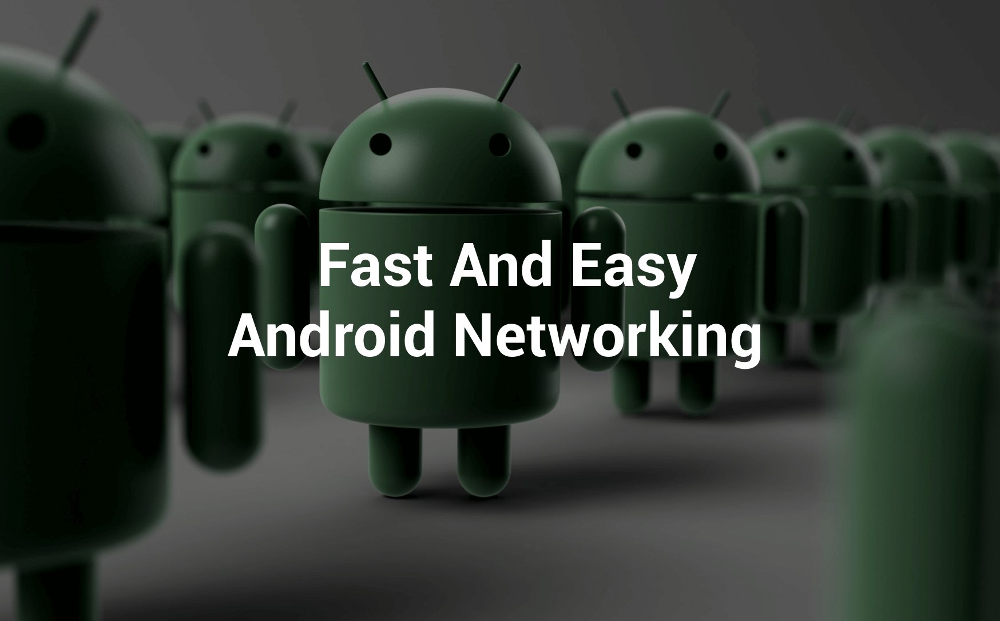

Fast Android Networking Library is a powerful library for doing any type of networking in Android applications which is made on top of [OkHttp Networking Layer](http://square.github.io/okhttp/).

##  Advantages of using Fast Android Networking library over other libraries:

* [OkHttpClient](http://square.github.io/okhttp/) can be customized for every request easily — like timeout customization, etc. for each request.
* As it uses [OkHttpClient](http://square.github.io/okhttp/) and [Okio](https://github.com/square/okio), it is faster.
* A single library for all types of networking — download, upload, multipart.
* Supports JSON Parsing to Java Objects (also support Jackson Parser).
* Proper Response Caching — which leads to reduced bandwidth usage.
* Complete analytics of any request can be obtained. You can know bytes sent, bytes received, and the time taken on any request. These analytics are important so that you can find the data usage of your application and the time taken for each request, so you can identify slow requests.
* You can get the current bandwidth and connection quality to write better logical code — download high quality images on excellent connection quality and low on poor connection quality.
* An executor can be passed to any request to get a response in another thread. If you are doing a heavy task with the response, you can not do that in main thread.
* Prefetching of any request can be done so that it gives instant data when required from cache.
* All types of customization are possible.
* Proper request cancelling.
* A simple interface to make any type of request.
* Supports RxJava.

## Why should you use Fast Android Networking Library?

* Recent removal of HttpClient in Android Marshmallow(Android M) made other networking library obsolete.
* No other single library do each and everything like making request, downloading any type of file, uploading file, loading image from network in ImageView, etc. There are libraries but they are outdated.
* As it uses [OkHttp](http://square.github.io/okhttp/) , most important it supports HTTP/2. 
* No other library provides simple interface for doing all types of things in networking like setting priority, cancelling, etc.


